# Observable Elixir

---

# Agenda

- What is Observability
- My Story
- `:telemetry`
- Structured Logging
- Metrics
- Distributed Tracing

---

# Bernardo Amorim

## Software Engineer @ Slab.com

---

# What is Observability?

---

According to Wikipedia

> Observability is a measure of how well internal states of a system can be
> inferred from knowledge of its external outputs.

<!-- Word from Control Theory -->
<!-- What do we want to know about the system? -->

---

We want to

- Understand whether the system is healthy or not
- Debug what went or is going wrong during crisis
- Find areas for improvement

---

# My Story

---

# Early Career (2012)

- Mostly monolithic Rails apps hosted on Heroku
- Mostly Rails apps
- Debugging with `heroku remote`
- `heroku logs` for logs
- New Relic for metrics

---

# Stone (2017~2019)

- Elixir microservices on Kubernetes (Azure / GCP)
- Debugging with `kubectl port-forward` + `iex --remsh`
  - Ability to use `:recon`, `:erlang.trace/3`, etc
- ELK Stack for logs
- Prometheus for metrics

---

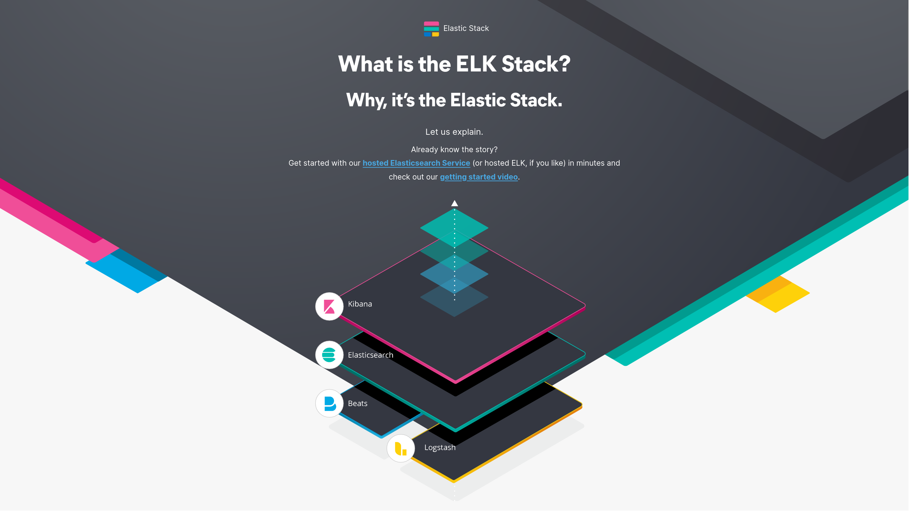

---

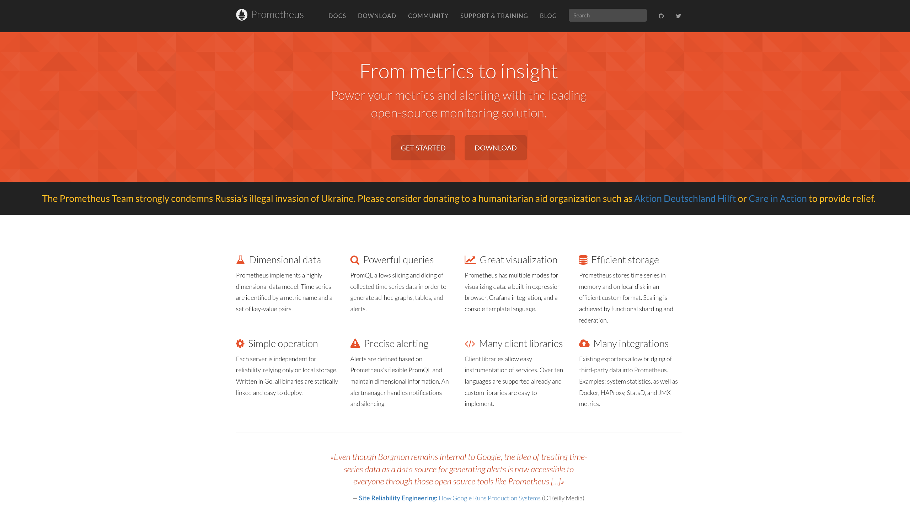

---

# At Salt (2021-2022)

- Elixir microservices on Kubernetes (AWS)
- Remote access strictly forbidden
- Grafana Stack (Grafana, Prometheus, Loki, Tempo) for logs, metrics and traces

---

# No more remsh, recon, etc


---

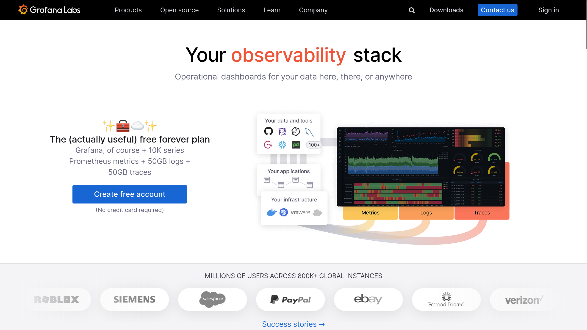

---

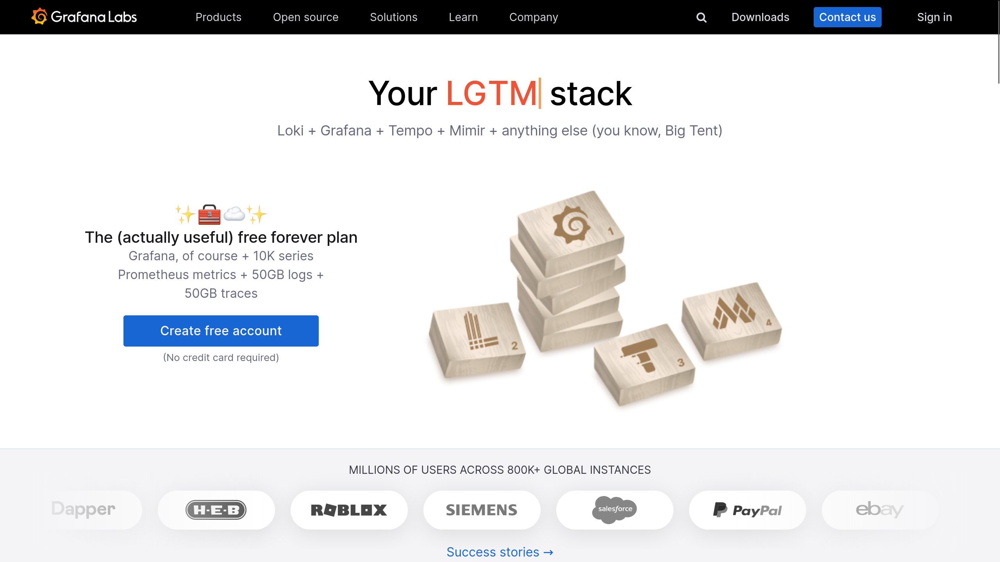

---

# The Demo App for this presentation

## [github.com/bamorim/observable-elixir-daily](https://github.com/bamorim/observable-elixir-daily)

---

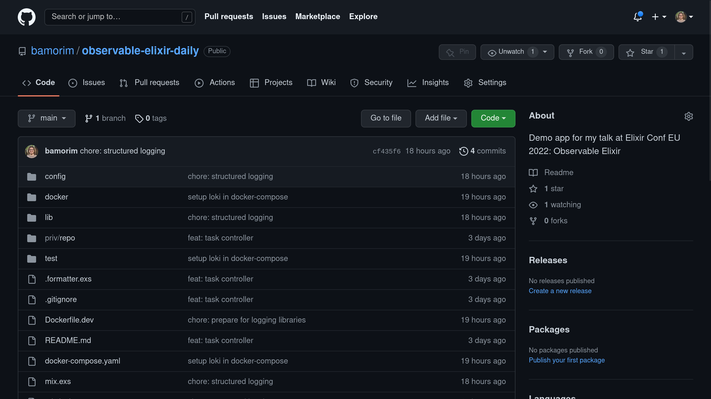

---

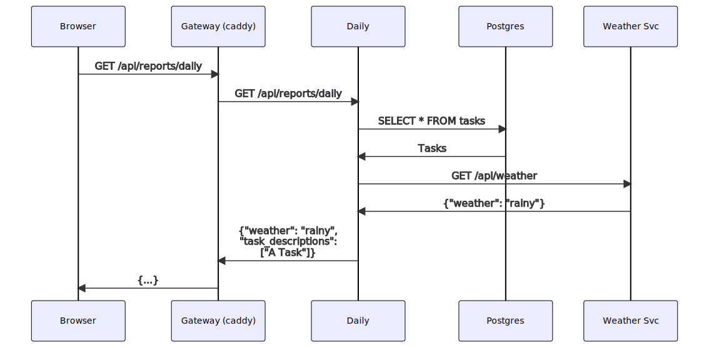

---

<video src="./videos/demo-observable-elixir.webm" controls width="100%"></video>

---

# Three Pillars of Observability

- Event Logs
- Metrics
- Traces

---

# Event Logs

- Things happen in your system
- Logs are a way for externalization
- Examples:
  - HTTP Request Handled
  - Database Query Executed
  - Background Job Executed

---

# Metadata

Common data

- Duration
- Response Status Code
- Path / Route

---

# Similar to `:telemetry` events

---

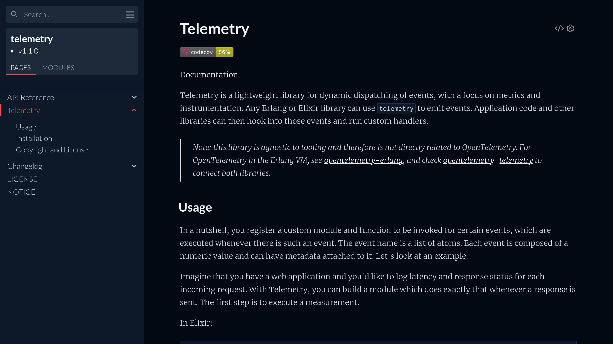

--- 

# `:telemetry` events

```elixir
@type event_name() :: [atom(), ...]
@type metadata() :: map()
@type measurements() :: map()
@type event() :: {event_name(), metadata(), measurements()}
```

---


---

# `:telemetry` spans

- Has a start and an end
- `:telemetry` defines a standard convention with 3 events:
  - `:start` with `:system_time` measurement
  - `:stop` and `:exception` with `:duration` measurement

---

# `:telemetry` span example

- `[:phoenix, :endpoint, :start]` when the request starts
- `[:phoenix, :endpoint, :stop]` when the requests finishes successfully
- `[:phoenix, :endpoint, :exception]` when an exception happens

---

# Logs are just `:telemetry` events that are externalized


---

# My problem with Phoenix default logging

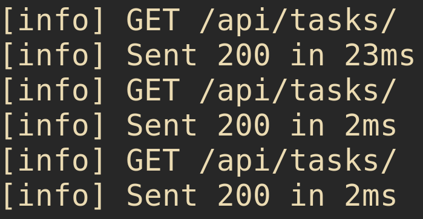

---

# Structured Logs

## Making it easy for machines to understand your logs

### TL;DR: Log in JSON or logfmt format

---

# Implement in Elixir

- Disable default Phoenix Logger
- Implement custom logger by listening to telemetry events
- Implement custom log formatter using Logfmt or JSON

---

# Implement in Elixir with Libraries

Many libraries for JSON Logging

- LoggerJSON
- Ink

---

# Implement in Elixir with Libraries

I'm open sourcing some internal libraries for logging we were using:

- [github.com/bamorim/telemetry_logger](https://github.com/bamorim/telemetry_logger)
- [github.com/bamorim/structured_logger](https://github.com/bamorim/structured_logger)

---

# Install the libraries

```elixir
  defp deps do
    [
      # Add the following deps
      {:telemetry_logger, github: "bamorim/telemetry_logger"},
      {:structured_logger, github: "bamorim/structured_logger"}
    ]
  end
```

Then run `mix deps.get`

---

# Switch to the new logger and formatter

```elixir
# Disable Phoenix Logger
config :phoenix, logger: false

# Set the formatter and allow all metadata
config :logger, :console,
  format: {StructuredLogger, :format},
  metadata: :all
```

```elixir
# Add to your MyApp.Application.start/2
TelemetryLogger.attach_loggers([
  {TelemetryLogger.PlugLogger, router: MyAppWeb.Router}
])
```

---

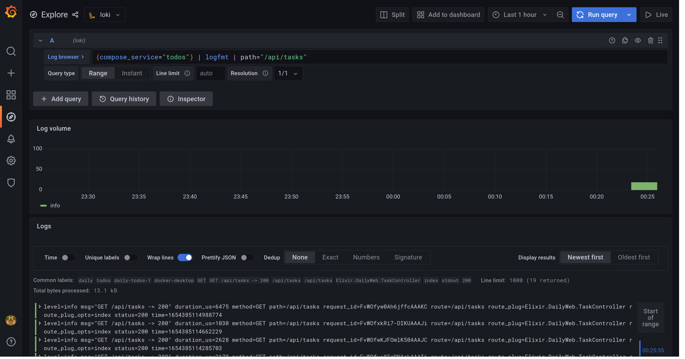

---

# Grafana, Loki and LogQL are Awesome

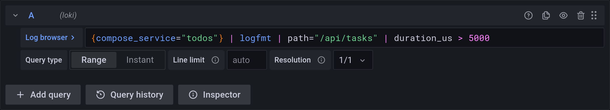
  
---

# Logs Tips

- **Do** use structured logging
- **Don't do** "print-debugging"
- **Do** take advantage of log levels
- **Do** allow your system to change log level without redeploying
- **Don't** nest fields in your logs

---

# Logs help with debugging, but

## How to check if the system is healthy?

- Requests/second
- Average (and other percentiles) latency
- Memory and CPU usage

---

# Metrics

## Numerical values sampled over time

---

# Metrics give you a high-level view of your system


- Useful both on a technical level (e.g. memory usage) or domain level (e.g. total count of payments processed)
- Great for visualizations

---


---

# Metrics are cheap and fast to process

- Complexity is only dependent on number of timeseries and sample frequency
- Great for alerting
- Great for long term storage
- Can be downsampled for even longer term storage

---

# Metrics - Data Model

```elixir
@type timeseries() :: {metric_id(), [sample()]}

@type metric_id() :: {metric_name(), metric_labels()}
@type sample() :: {sample_value(), timestamp()}

@type metric_name() :: String.t()
@type metric_labels() :: %{String.t() => String.t()}
@type sample_value() :: float()
@type sample_timestamp() :: integer()
```

---

# Computing metrics from `:telemetry` events

- `Plug.Telemetry` emits `[:phoenix, :endpoint, :stop]` events
- We can count the number of events emitted and aggregate into the "total number of requests"
- Maybe keep count of requests per route

---

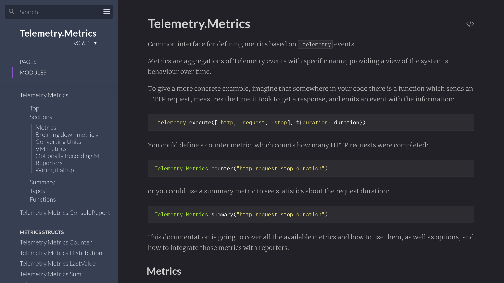

---

## `Telemetry.Metrics`

- Language for defining `:telemetry` based metrics
- Define 5 different metric types (counter, distribution, last value, sum and summary)
- Metric Reporters attach to events and aggregate them


---

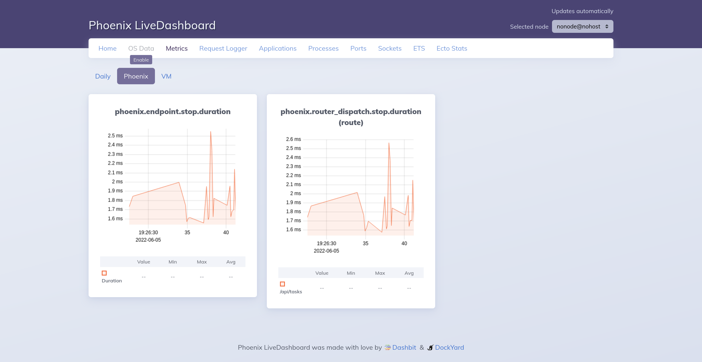

---

```elixir foit
defmodule DailyWeb.Telemetry do
  use Supervisor
  import Telemetry.Metrics

  # ...

  def metrics do
    [
      # Phoenix Metrics
      summary("phoenix.endpoint.stop.duration",
        unit: {:native, :millisecond}
      ),
      summary("phoenix.router_dispatch.stop.duration",
        tags: [:route],
        unit: {:native, :millisecond}
      ),
      # ...
    ]
  end
end
```

---

# Limitations of LiveDashboard

- Metrics are not persisted
- If you have multiple apps it will be hard to consolidate visualizations and data
- Only works for Elixir

---


---

# Prometheus

- Open-source monitoring and alerting system
- A multi-dimensional data model for time-series data
- PromQL: query language
- Data collection via **pull** over simple HTTP protocol

---

# Prometheus is a big ecossystem

- Compatible alternatives for parts of the system (for example, long-term storage):
  - Grafana Mimir
  - Grafana Cortex
  - Thanos
- Exporters for systems like Postgres, Redis, HAProxy, etc

---

# Pull vs Push

- Prometheus is Pull, that is, Prometheus controls when to ask for metrics
  - Improves back-pressure (if Prometheus is overloaded it can delay the sampling)
- Your app just need to:
  - Keep last values for metrics
  - Be able to report them when Prometheus request (in a specific format)
- For short-lived jobs, there is the Pushgateway

---

# Prometheus Format

### Metric Names

```prometheus
my_metric{label1=value1}
my_metric{label1=value2}

other_metric{label=value}
```

### Prometheus Exposition Format

```prometheus
my_metric{label1=value1} 101
my_metric{label1=value2} 42

other_metric{label=value} 3.14
```

---

# Integrating Prometheus with Elixir

---

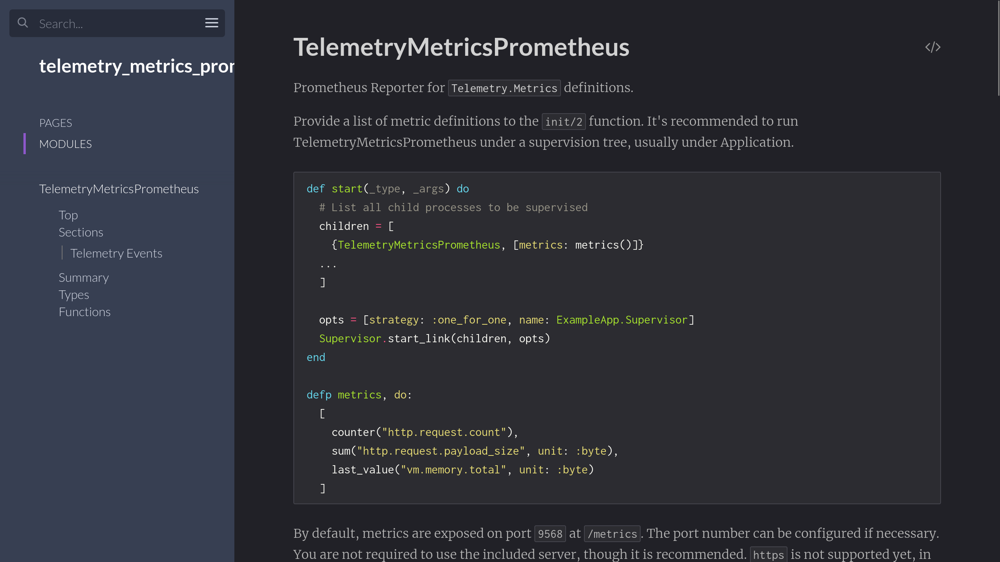

---


---

# `PromEx`

- Just another handler
- Shared core with `TelemetryMetricsPrometheus`
- Nice library of ready-made metrics and Grafana dashboards
- For something more minimalist, `TelemetryMetricsPrometheus` is probably your best bet.


---

# Install PromEx

Add the dependency

```elixir
  defp deps do
    [
      {:prom_ex, "~> 1.7.1"}
    ]
  end
```

Run `mix prom_ex.gen.config --datasource prometheus`

---

You should end up with something like this:

```elixir
defmodule Daily.PromEx do
  use PromEx, otp_app: :daily

  @impl true
  def plugins do
    #...
  end

  @impl true
  def dashboard_assigns do
    # ...
  end

  @impl true
  def dashboards do
    # ...
  end
end
```

---

If you follow the instructions on the generated file you can then enable the relevant plugins, for example:

```elixir
def plugins do
  [
    Plugins.Application,
    Plugins.Beam,
    {Plugins.Phoenix, router: DailyWeb.Router, endpoint: DailyWeb.Endpoint},
    Plugins.Ecto
  ]
end
```

---

The instructions will also tell you to set some configs and

```elixir
defmodule DailyWeb.Endpoint do
  use Phoenix.Endpoint, otp_app: :daily

  # Add this line 
  plug PromEx.Plug, prom_ex_module: Daily.PromEx
end
```

```elixir
defmodule Daily.Application do
  def start(_type, _args) do
    children = [
      # Add PromEx to the supervision tree
      Daily.PromEx,
      # ...
    ]
    # ...
  end
end
```

Now you can get metrics in prometheus format at `http://localhost:4000/metrics`

---

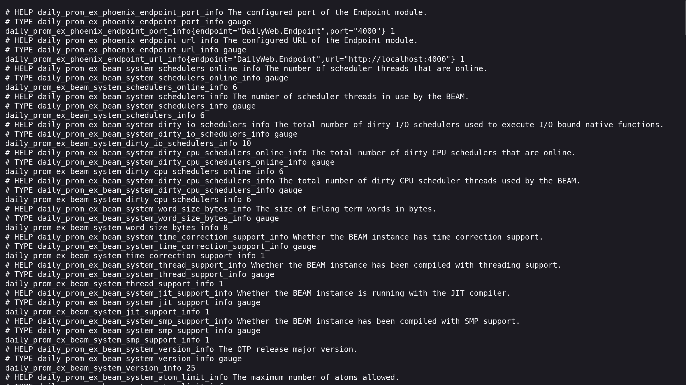

---

## Instructing Prometheus to scrape metrics

This will vary depending on your setup, but it should be something as easy as configuring this:

```yaml
scrape_configs:
  - job_name: 'daily'
    scrape_interval: 5s
    static_configs:
      - targets: ['daily:4000']
```

And now you can query through Grafana (or other frontends)

---

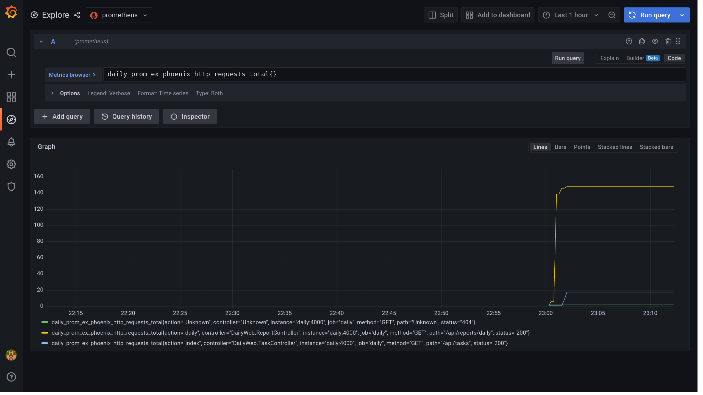

---

And let's say you have something like

```elixir
def dashboards
  [
    {:prom_ex, "application.json"},
    {:prom_ex, "beam.json"},
    {:prom_ex, "phoenix.json"},
    {:prom_ex, "ecto.json"}
  ]
end
```

And you run something like

```bash
for dashboard in application beam phoenix ecto; do
  mix prom_ex.dashboard.export -m 'Daily.PromEx' -d "$dashboard.json" -s > ./docker/grafana/$dashboard.json
done
```

Each will generate a JSON file you import into Grafana.

---

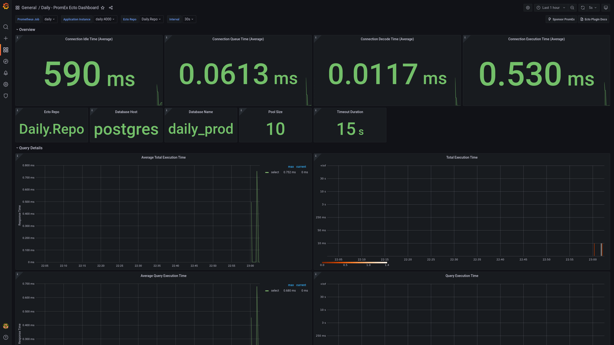